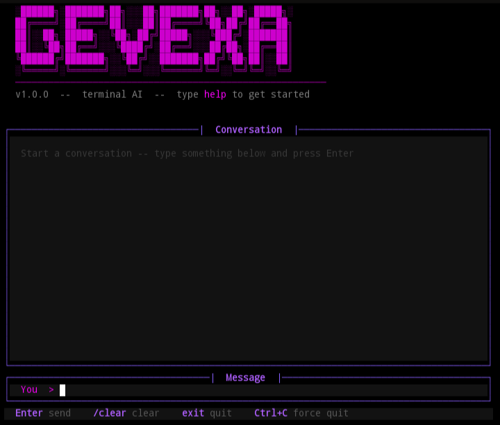

Gevexa-beta CLI

Gevexa-beta is a futuristic terminal AI assistant designed to deliver a clean, smooth, and enjoyable command-line experience. It combines a modern interface with a simple customizable brain system, making it both fun and flexible to use.

---

Preview

  

A clean and expressive terminal interface powered by Python.

---

Features

- Custom AI brain using "brain.json"
- Interactive chat interface
- Smooth typing animation for responses
- Clean purple-themed terminal UI
- Simple and responsive controls
- Lightweight and fast

---

Requirements

Install the required packages:

pip install prompt_toolkit rich pyfiglet

---

Run

Start the application:

python ai_terminal.py

---

Brain System

The assistant uses a simple JSON-based knowledge system:

brain.json

Example:

{
  "hello": "Hi there, nice to see you.",
  "who are you": "I am Gevexa-beta, your friendly terminal assistant.",
  "help": "Try commands like help, exit, or /clear."
}

---

Controls

Key| Function
Enter| Send message
/clear| Clear chat
exit| Exit application
Ctrl + C| Force quit
Ctrl + L| Quick clear

---

Project Structure

.
├── ai_terminal.py
├── brain.json
├── proof.png
└── README.md

---

Configuration

You can customize the identity of the assistant in the code:

APP_NAME = "Gevexa-beta"
VERSION  = "v1.0.0"
AI_NAME  = "Gevexa-beta"

---

Future Improvements

- Integration with advanced AI models
- Smarter memory handling
- Voice interaction support
- Multi-language capability
- Theme customization

---

Author

Built with passion as part of the Gevexa project.

---

License

Free to use and modify.

---

Gevexa-beta brings a joyful and expressive AI experience directly into your terminal.
